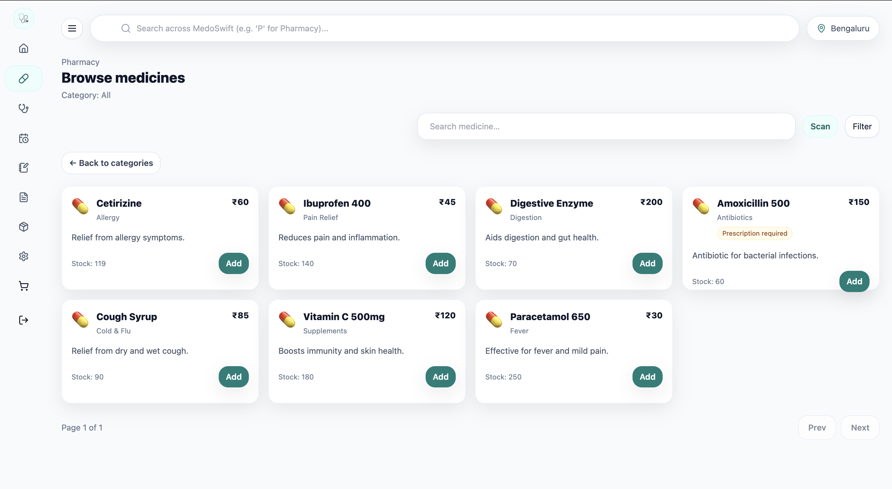
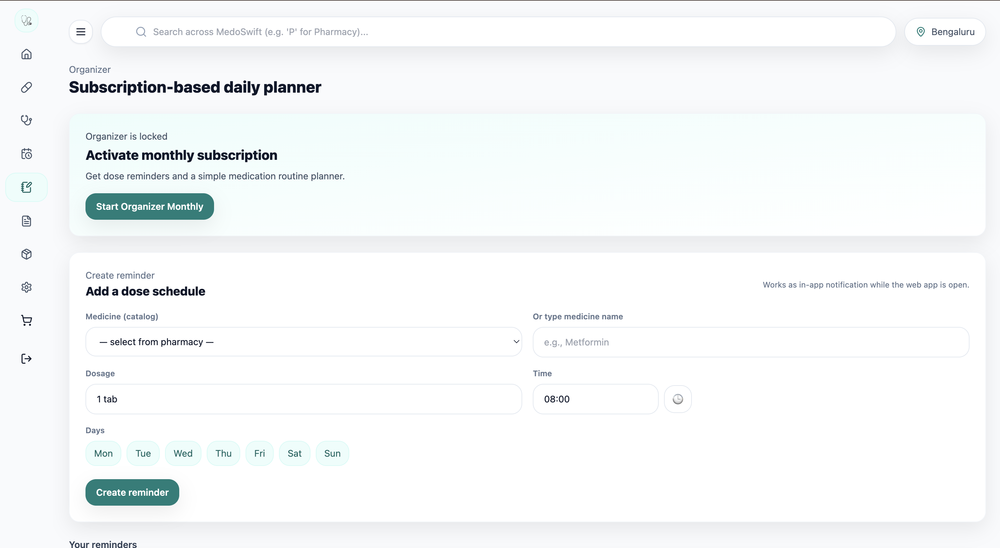
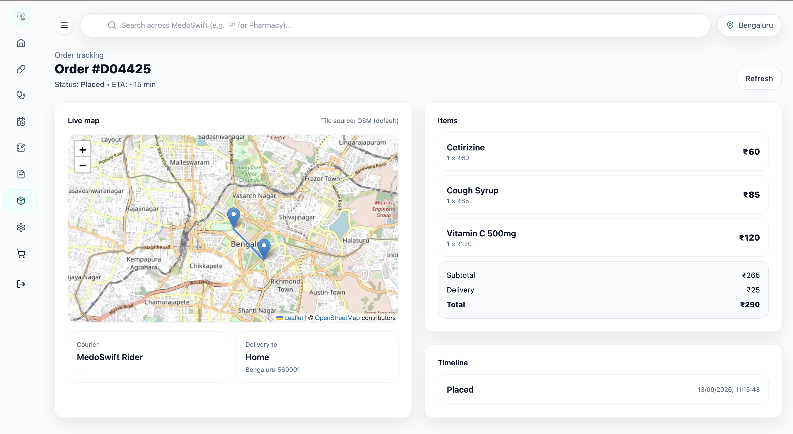
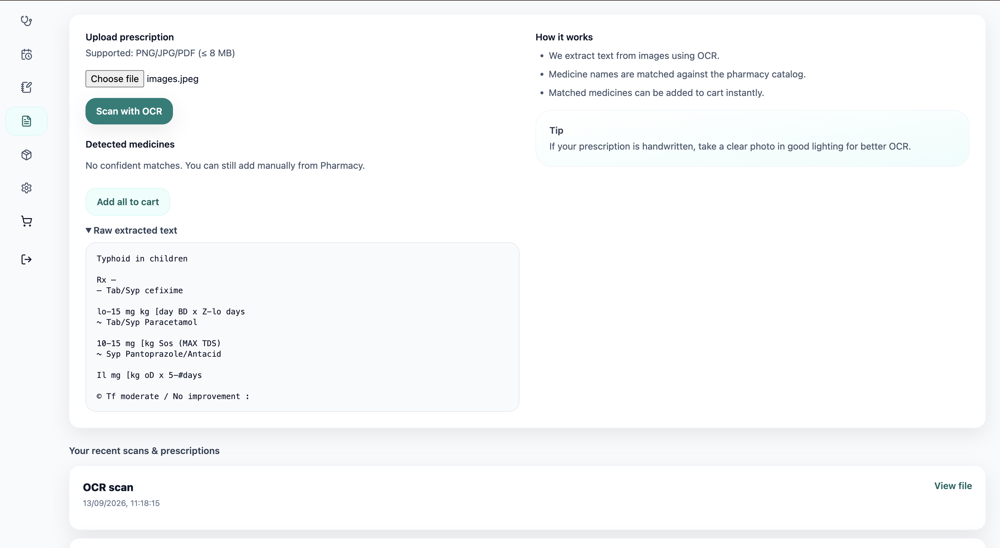
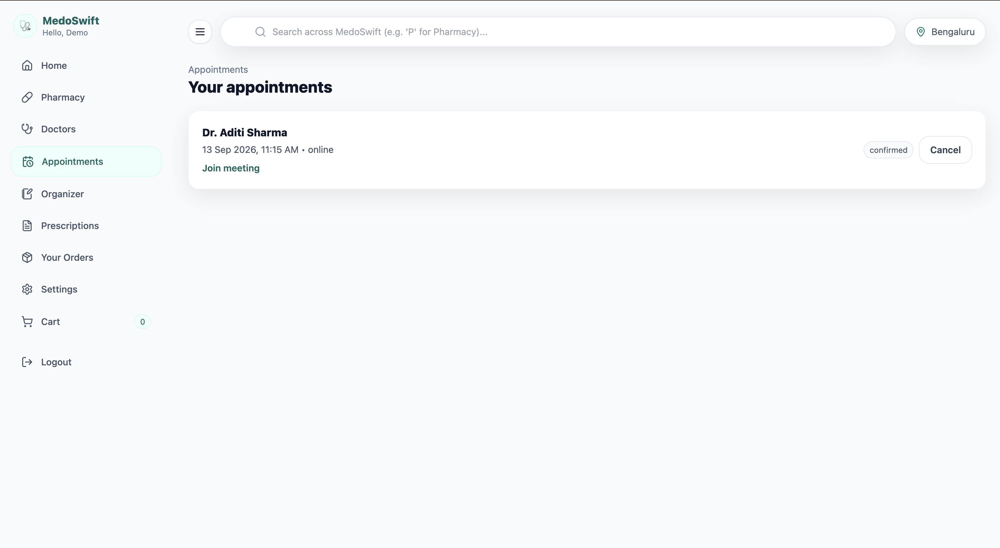
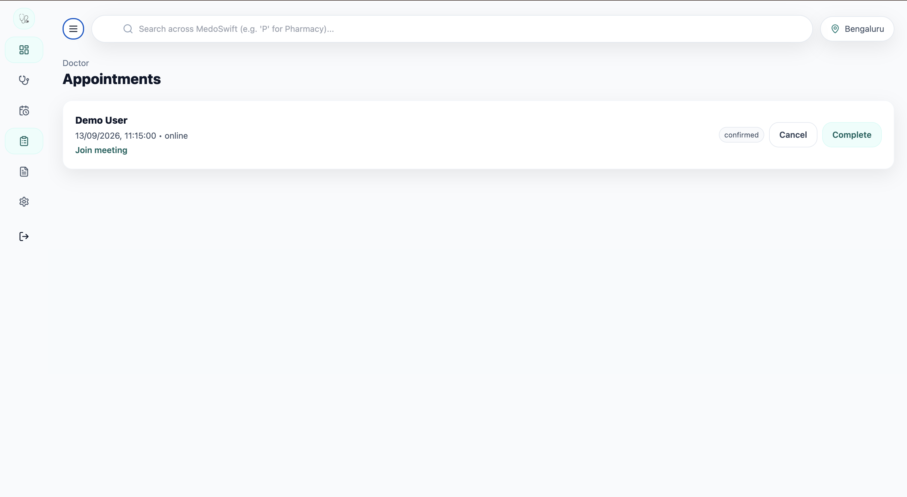

# MedoSwift (MERN)

An online medical consultation and medicine delivery platform built with the MERN stack. Features JWT authentication, Role-Based Access Control (User/Doctor/Admin), doctor booking, pharmacy, prescription OCR processing, pill organizer/reminders, and live order tracking using Leaflet + OpenStreetMap.

## 📸 Screenshots

|   |   |
|---|---|
|  |  |
|  |  |
|  |  |
|  | |

## 🚀 Technologies

- **Frontend**: React, Vite, TailwindCSS, React Router, Framer Motion, Recharts, Leaflet
- **Backend**: Node.js, Express, MongoDB (Mongoose), Socket.IO, Zod validation
- **APIs & Features**: Tesseract.js (OCR), OpenStreetMap (Live Tracking)

## 📦 Requirements

- Node.js 18+
- MongoDB (local or Atlas)

## 🛠️ Installation & Setup

### 1. Configure environment

**Backend**
```bash
cd server
cp .env.example .env
```
Update `.env` with your `MONGO_URI` and `JWT_SECRET`. The default port is `5001`.

**Frontend**
Create `client/.env` to configure your API URL:
```bash
VITE_API_URL=http://localhost:5001
```

### 2. Install dependencies

Run the following command from the project root to install all dependencies for both frontend and backend:
```bash
npm run install:all
```

### 3. Seed dummy data

Populate your database with sample accounts and data:
```bash
npm run seed
```

### 4. Run the application

Start the development servers for both frontend and backend:
```bash
npm run dev
```

- **Client**: `http://localhost:5173`
- **Server**: `http://localhost:5001`

## 👥 Demo Accounts

Use these credentials to test different roles:
- **Admin**: `admin@medoswift.dev` / `Admin@123`
- **User**: `user@medoswift.dev` / `User@1234`
- **Doctor**: `aditi@medoswift.dev` / `Doctor@123`

## 📝 Additional Notes

- **Maps**: Uses Leaflet + OpenStreetMap tiles (no API key required).
- **OCR**: Uses Tesseract.js for images and `pdf-parse` for PDF text extraction.
- **Payments**: Mock payment is implemented; Stripe can be easily integrated by extending the payment endpoint.

## 📄 License
MIT
